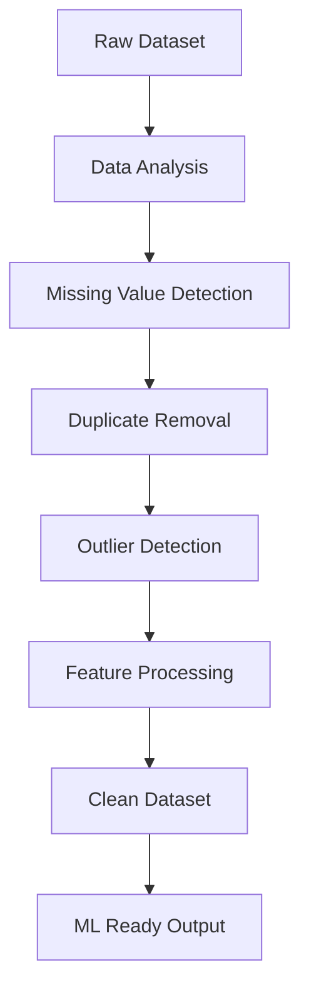

 AI Powered Data Cleaning

<p align="center">
  
</p>

<p align="center">
  
</p>

<p align="center">
  <b>Transform messy raw datasets into clean, ML-ready data using AI-driven preprocessing automation.</b>
</p>

<p align="center">
  <a href="#">
    
  </a>
  <a href="#">
    
  </a>
  <a href="#">
    
  </a>
  <a href="#">
    
  </a>
  <a href="#">
    
  </a>
</p>

---

 ✨ Overview

**AI Powered Data Cleaning** is an intelligent data preprocessing and cleaning system designed to automate repetitive and time-consuming data preparation tasks.

The project helps data scientists, analysts, and machine learning engineers clean noisy datasets efficiently using AI-assisted techniques including:

* Missing value handling
* Duplicate removal
* Smart outlier detection
* Data normalization
* Feature preprocessing
* Intelligent column analysis
* Automated transformation pipelines

The goal of this project is to reduce manual preprocessing effort and improve workflow efficiency for real-world machine learning pipelines.

---

 🧠 Key Features

## ✅ Intelligent Data Cleaning

Automatically identifies and fixes common dataset issues.

 ✅ Missing Value Handling

Supports multiple strategies:

* Mean / Median Imputation
* Mode Filling
* Forward / Backward Fill
* AI-assisted handling

## ✅ Duplicate Detection

Detects and removes duplicate records efficiently.

## ✅ Outlier Detection

Uses statistical and AI-driven techniques for anomaly detection.

## ✅ Feature Engineering Ready

Prepares datasets for:

* Machine Learning
* Deep Learning
* Analytics
* Visualization

## ✅ Smart Data Type Detection

Automatically identifies:

* Numerical columns
* Categorical columns
* Text columns
* Date/Time columns

## ✅ Scalable Pipeline

Designed for integration into:

* ML workflows
* Research pipelines
* Analytics dashboards
* Production preprocessing systems

---

# 🏗️ Project Architecture

```bash
AI_Powered_Data_Cleaning/
│
├── data/                     # Input datasets
├── notebooks/                # Jupyter notebooks
├── src/                      # Source code
│   ├── preprocessing/        # Cleaning modules
│   ├── models/               # AI/ML utilities
│   ├── utils/                # Helper functions
│   └── pipeline/             # Automation pipeline
│
├── outputs/                  # Cleaned datasets
├── requirements.txt          # Dependencies
├── main.py                   # Main execution file
└── README.md
```

---

# ⚡ Workflow



---

# 📊 Supported Cleaning Operations

| Feature            | Description                               |
| ------------------ | ----------------------------------------- |
| Missing Values     | Handles null and NaN values intelligently |
| Duplicate Removal  | Removes repeated rows                     |
| Outlier Detection  | Detects anomalies using statistics/AI     |
| Data Encoding      | Converts categorical data                 |
| Scaling            | Standardization and normalization         |
| Feature Selection  | Improves model performance                |
| Data Validation    | Detects inconsistent entries              |
| Automated Pipeline | One-click preprocessing                   |

---

# 🛠️ Tech Stack

<p align="center">
  
</p>

### Core Technologies

* Python
* Pandas
* NumPy
* Scikit-learn
* Matplotlib
* Seaborn
* Jupyter Notebook
* Machine Learning Utilities

---

# 📥 Installation

## 1️⃣ Clone Repository

```bash
git clone https://github.com/Dibyacodecraft/AI_Powered_Data_Cleaning.git
```

## 2️⃣ Move Into Project

```bash
cd AI_Powered_Data_Cleaning
```

## 3️⃣ Install Dependencies

```bash
pip install -r requirements.txt
```

---

# ▶️ Run The Project

```bash
python main.py
```

Or launch Jupyter notebooks:

```bash
jupyter notebook
```

---

# 📌 Example Use Cases

## 📈 Data Science Projects

Prepare raw datasets before training ML models.

## 🤖 Machine Learning Pipelines

Automate preprocessing for faster experimentation.

## 🧪 Research Work

Handle large noisy datasets efficiently.

## 🏢 Business Analytics

Clean business/customer datasets before analysis.

---

# 📷 Preview

<p align="center">
  
  
  
</p>

---

# 📚 Educational Value

This project is ideal for learning:

* Data preprocessing fundamentals
* Machine learning workflows
* Data cleaning automation
* AI-assisted analytics
* Feature engineering techniques
* End-to-end ML pipelines

Perfect for:

* Students
* Beginners in Data Science
* AI/ML Enthusiasts
* Research Developers
* Open Source Contributors

---

# 🚀 Future Improvements

* [ ] Real-time dataset cleaning
* [ ] Web dashboard integration
* [ ] AutoML preprocessing recommendations
* [ ] NLP-based column understanding
* [ ] Cloud deployment support
* [ ] Streamlit / FastAPI integration
* [ ] Large-scale distributed processing

---

# 🤝 Contributing

Contributions are welcome.

If you'd like to improve this project:

1. Fork the repository
2. Create a feature branch
3. Commit your changes
4. Push the branch
5. Open a Pull Request

```bash
git checkout -b feature/amazing-feature
```

---

# ⭐ Support

If you found this project useful:

* ⭐ Star the repository
* 🍴 Fork the project
* 🧠 Share with the community
* 🚀 Contribute improvements

---

# 📄 License

This project is licensed under the **MIT License**.

---

# 👨‍💻 Author

<p align="center">
  
</p>

<p align="center">
  <b>DibyaCodeCraft</b>
</p>

<p align="center">
  AI • Data Science • Machine Learning • Open Source
</p>

---

# 🌟 Final Note

> "Clean data is the foundation of every successful AI system."

This repository represents a practical step toward automating intelligent data preprocessing for modern machine learning workflows.

<p align="center">
  
</p>
